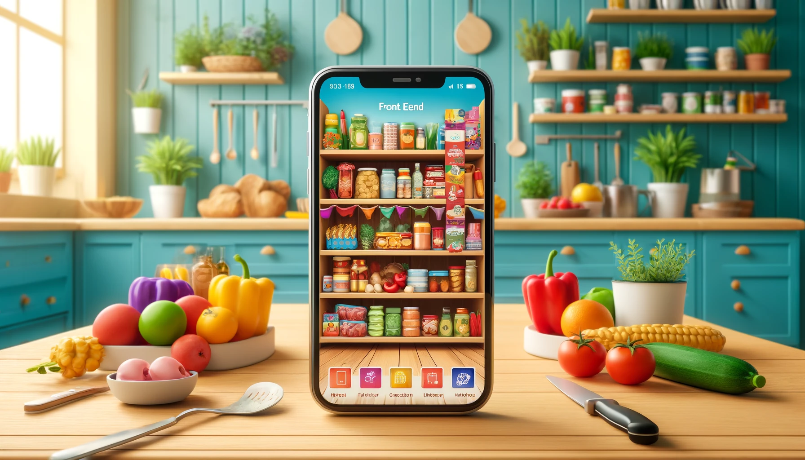

<p align="center">
  
</p>

---


```markdown
# DineIn Frontend

Welcome to the DineIn frontend repository. DineIn aims to streamline pantry management, recipe discovery, and grocery shopping through a user-friendly interface. This guide will help you set up your development environment and start contributing to the project.

## Quick Start

1. **Prerequisites**: Ensure you have Node.js and npm installed. [Node.js](https://nodejs.org/en/download/)
2. **Clone the repository**:

```

   git clone https://github.com/food-and-pantry-app/Frontend.git
   cd Frontend

```

3. **Install dependencies**:

```

   npm install

```

4. **Run the development server**:

```

   npm run dev


   Your development server is now running and accessible at `http://localhost:3000`.

## Tools and Libraries

- **Vite**: A fast, modern build tool for Vue, React, and more. [Vite Documentation](https://vitejs.dev/guide/)
- **React**: A library for building user interfaces. [React Documentation](https://reactjs.org/docs/getting-started.html)
- **Axios**: For making HTTP requests from the browser. [Axios Documentation](https://axios-http.com/docs/intro)

## Useful Commands

- `npm run dev`: Starts the Vite development server.
- `npm run build`: Builds the app for production to the `dist` folder.
- `npm run preview`: Locally preview production build.

## Contributing

Please follow the project's coding standards and guidelines. If you're new to the project, look for open issues labeled `good first issue`.

For more information on how to contribute, please refer to our [contribution guidelines](#).
